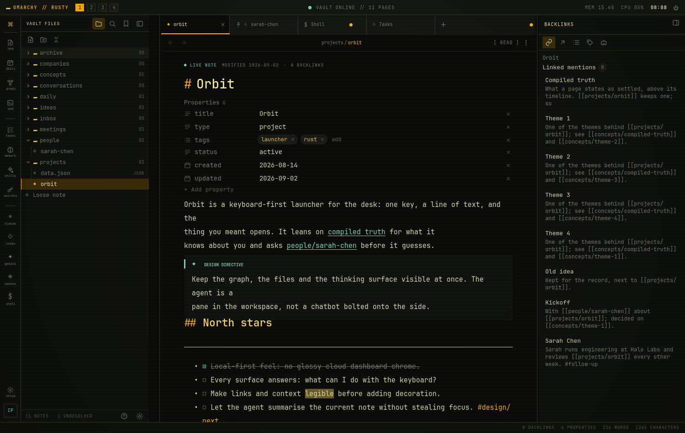
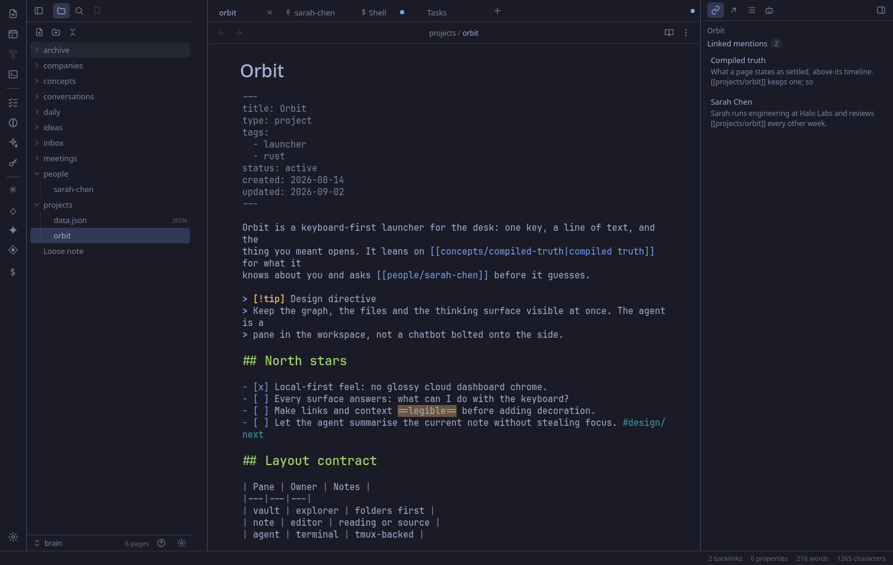
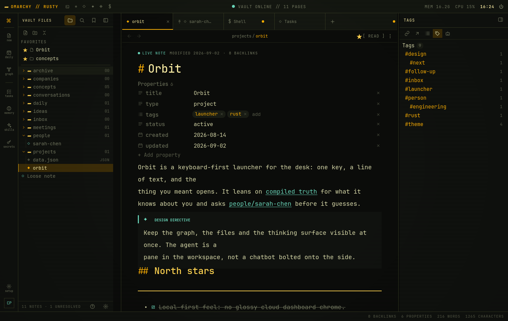
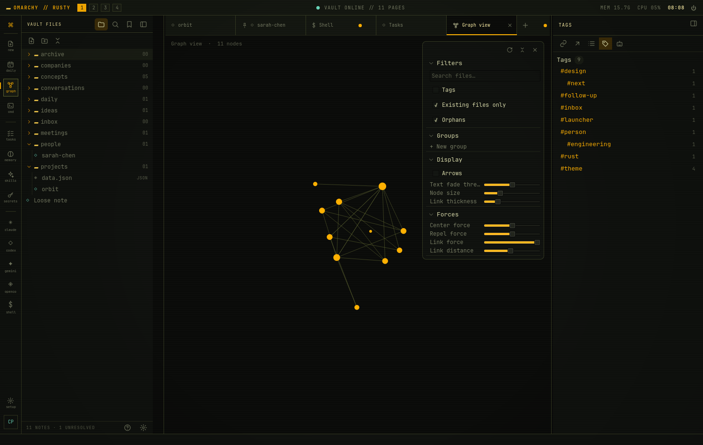
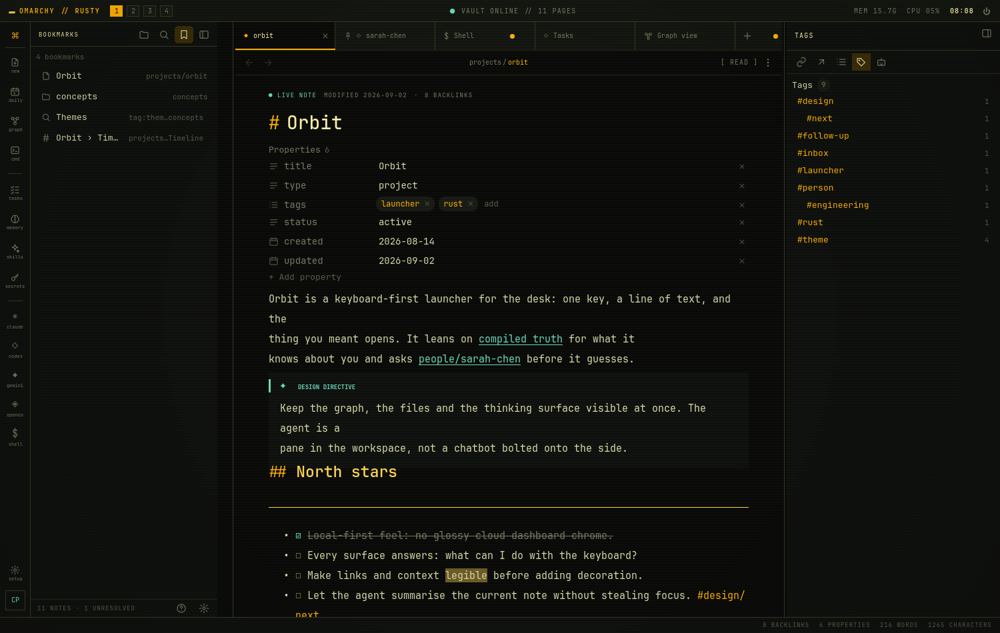
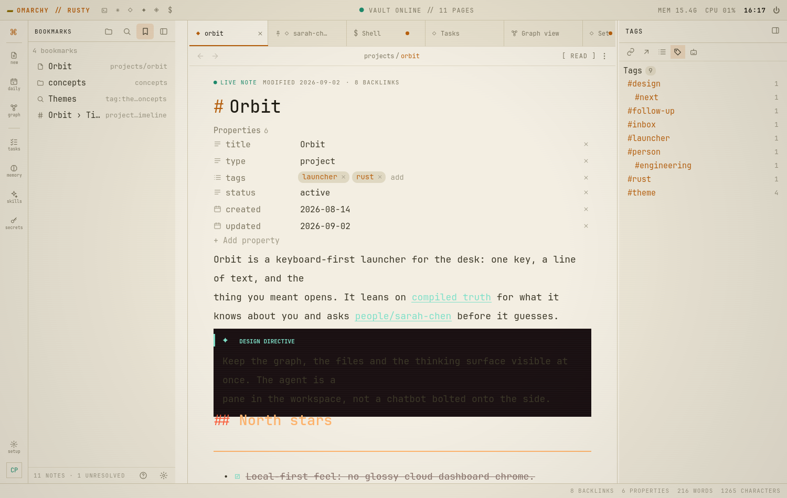

# Rusty

A local-first AI assistant for [Omarchy](https://omarchy.org): a knowledge workspace laid
out the way Obsidian lays out a vault, with a pure MCP back end, a markdown brain any
markdown tool can open, to-do lists, memories and skills, and terminals that run Claude Code
and Codex natively as tabs and as a pane beside the note.



**Status: v3, not yet released.** See `ROADMAP.md` for the plan and `docs/architecture.md`
for the shape.

## Status

Milestones M0 to M5 and M7 of `ROADMAP.md` landed on 2026-09-02: the back end, the desktop
app with agent terminals, and semantic search behind a provider setting. M8 (Obsidian inside
Rusty) landed on 2026-09-03: the workspace shell, tags and properties, graph views, search
operators and bookmarks, and the retirement of the Obsidian bridge. What is left in M6 is the
first release.

## Run it

```bash
rusty                    # the app; or `omarchy-launch-or-focus rusty`
rusty-mcp                # the back end over stdio (agents); the user service serves HTTP
rusty-cli brain search "orbit"
```

## The workspace

The window is Obsidian's layout. A ribbon on the left: new note, today's daily note, the
command palette, then Tasks, Memory, Skills and Secrets, one button per agent CLI found on
the machine (Claude Code, Codex, Gemini, Aider, OpenCode, a shell), and Settings at the
bottom. The left sidebar holds the file explorer (the vault's real folders, with new note,
new folder, rename, move and delete on a right click; a rename rewrites every link to the
page) and search. The main area holds tabs: pages, agent terminals and the built-in views,
each closable, pinnable and remembered between runs. The right sidebar holds backlinks with
their context lines, outgoing links (an unresolved one creates the page), the outline, and an
agent pane that runs a terminal beside the note. The status bar counts backlinks,
properties, words and characters.

A page opens in reading view: the inline title (Enter renames the file), the properties from
its frontmatter, then the body rendered in Obsidian's flavour by the back end (wikilinks with
aliases and headings, page and image embeds, callouts, task boxes that toggle on click,
tables, footnotes, `==highlights==`, `#tags`, hidden `%% comments %%`, fenced code). Ctrl+E
switches to the source, the whole file with markdown highlighting; edits autosave after a
pause and on Ctrl+S.



Tags and properties work as they do in Obsidian. Every tag counts, whether it sits in
the frontmatter list or inline as `#tag` in the body (nested `a/b` counts under `a`);
the Tags pane in the right sidebar lists them as a tree with counts, and a click, or a
`#tag` in a page, searches with `tag:<name>`, which `brain_search` understands alone or
with words. The properties block edits the frontmatter in place by type: text, a date,
a number, a checkbox, or a list of chips; a row can go, and "Add property" adds one. A
property edit changes only the frontmatter; the body stays byte for byte.



The graph view (Ctrl+G, the ribbon, or "Open local graph" on a page) draws the vault as
Obsidian does: pages as dots sized by their links, links as lines, laid out by forces on
a canvas, with a panel of Filters (search, tags, existing files only, orphans), Groups
(a `tag:`, `path:`, `type:` or text query with a colour from the theme's palette),
Display (arrows, text fade, node size, link thickness) and Forces (centre, repel, link,
link distance). Drag the background to pan, wheel to zoom, hover a node to see its title
and its neighbours, click it to open the page. A local graph shows one page's
neighbourhood to a chosen depth and follows the page you open.



Search narrows the way Obsidian's does. `path:`, `file:`, `tag:` and `type:` terms sit
in the query with the words (a value in quotes may hold spaces, a leading `-` excludes,
and operator terms alone list the matching pages); the two chips beside the field switch
match case and regular expressions; the third bookmarks the search. `brain_search` takes
the same query and the two modes as `case_sensitive` and `regex`, so an agent narrows a
search the way the pane does. The Bookmarks tab of the left sidebar keeps files,
folders, searches and headings, added from a page's menu, the explorer, the search pane,
the outline or the palette; a click opens the target. Settings lists every command with
its key in a Hotkeys table with a filter.



Keys follow Obsidian: Ctrl+O quick switcher (type a name that does not exist and Enter
creates it), Ctrl+P command palette (every command with its key), Ctrl+N new note, Ctrl+E
reading or source, Ctrl+W close tab, Ctrl+Tab and Ctrl+Shift+Tab (or Ctrl+PgUp/PgDn) switch
tabs, Ctrl+Shift+F search, Ctrl+, settings, Alt+Left/Right back and forward, F2 rename.
While a terminal has focus the workspace keys stand down, because the shell and Claude Code
use the same ones; Ctrl+Shift+T (custom terminal), Ctrl+Shift+W and Ctrl+PgUp/PgDn work
everywhere. Each terminal is a tmux session that outlives the window; a tab that gets output
while another is showing gets a mark, and a title that asks for attention raises a desktop
notification.

Colours come from the Omarchy theme: its `obsidian.css` tokens and its Alacritty palette,
so the workspace and Obsidian look alike, and `omarchy theme set` re-themes the running app.



Under Omarchy the app's messages go to the journal when it is not started from a terminal:
`journalctl --user -t rusty`, or `QT_FORCE_STDERR_LOGGING=1`; `RUSTY_DEBUG=1` adds a line
per event. `scripts/screenshot.sh <dir>` renders the scenes above offscreen against a
scratch vault, which is how the screenshots in `docs/screenshots/` are made. Every view talks
to the back end over `http://127.0.0.1:4174/mcp`, so a Claude session changing a page or a
task shows up in the app as it happens.

## How work happens

Spec-driven and phase-gated: `CONSTITUTION.md` is the law, `AGENTS.md` (and `CLAUDE.md`)
route the work, `.claude/skills/rusty-workflow/` is the driving manual, and
`docs/planning/` holds tickets, the active spec/notes pair, the knowledge register and the
after-action reviews. `bin/gate.sh --diff` is the gate; green writes a receipt bound to the
worktree, and gated files cannot be committed without one. CodeGraph supplies structural
evidence at design and inspect, and OpenWiki keeps the generated engineering wiki under
`openwiki/`: every pipeline reconciles it at complete through the `openwiki` skill, and a
completed pipeline is delivered only with the completion receipt that run leaves.
`scripts/setup-pipeline-tools.sh` installs both, pinned and project-local.

## Layout

```
crates/rusty-core   the manager layer: tasks, notes, memories, brain vault + index, skills, secrets, settings
crates/rusty-mcp    the back end: an MCP server on rmcp, 65 tools, stdio and local Streamable HTTP
crates/rusty-app    the desktop app: the workspace in QML on cxx-qt, native agent terminals (binary `rusty`)
crates/rusty-cli    terminal access to the same store: brain, tasks, notes, refresh, conversation ingest
docs/               architecture and vault rules
omarchy/            the user service unit and MCP config snippets; installer, desktop entry and hooks arrive with M6
```

## Build

```bash
cargo build
cargo test
```

Data lives in `~/.rusty/`: `rusty.db` (SQLite), `brain/` (the vault), `notes/`, `skills/`,
`.secret` (the vault of secrets, mode 600).

## Use the MCP server

From Claude Code or Codex over stdio:

```json
{ "mcpServers": { "rusty": { "type": "stdio", "command": "rusty-mcp" } } }
```

For the app, or any HTTP client, one shared process on localhost:

```bash
rusty-mcp --http                 # Streamable HTTP at http://127.0.0.1:4174/mcp
```

On a machine that will run Rusty for real, `omarchy/install.sh` builds both binaries into
`~/.local/bin`, and installs and starts the `rusty-mcp` user service. Run it again after
pulling; every step is idempotent.

## Semantic search

`brain_search` merges full-text hits with nearest neighbours from `sqlite-vec` when an embedding
provider is configured; without one it stays full-text and nothing else changes. The settings
(`settings_set`, or the Settings tab): `embedding_provider` is `auto` (the default: Ollama when
it answers on this machine), `ollama`, `openai`, or `off`; `embedding_model` overrides the
provider's default (`nomic-embed-text`, `text-embedding-3-small`); `ollama_url` defaults to
`http://127.0.0.1:11434`. OpenAI needs `openai_api_key` (or `OPENAI_API_KEY`) in the secrets vault and sends page
text to OpenAI, so it is never picked by itself. The server embeds new and changed pages a few
seconds after they change; `rusty-cli brain embed --all` or the `brain_reembed` tool rebuilds,
and `rusty-cli brain semantic` shows the state. Changing the provider or model rebuilds the
index, because vectors from different models do not compare.

## Vault tools

The workspace's own tools, which agents share: `brain_tree` (the folders and files),
`brain_render` (a page as rich text, with its outline, links, unresolved targets, counts,
properties and raw file), `brain_write_page` (the whole file, as an editor saves),
`brain_new_page`, `brain_new_folder`, `brain_delete_folder` (soft, into `archive/`),
`brain_rename` (page or folder, every link rewritten, index rows moved),
`brain_unresolved`, `brain_tags` (every tag with its count), `brain_set_property` and
`brain_remove_property` (one frontmatter key, typed), and `brain_graph` (pages and links
as nodes and edges, tags and unresolved targets on request, or one page's neighbourhood). A vault file without frontmatter is a page too: its title is the file
name and its type comes from its top folder (`people/` is `person`), or `note`. The server
also indexes files changed by another program (Obsidian, an editor, git) a few seconds after
they change.

## Obsidian

The brain folder is a plain Obsidian vault, and Obsidian still opens it; Rusty's own
workspace is where the vault is read and written. The bridge that drove Obsidian's
command-line interface (six `obsidian_*` tools, `rusty-cli obsidian`, the installer's
registration, the app's theme-snippet call) was retired on 2026-09-03 (TICKET-006) once the
workspace covered what it did: `brain_get_links`, `brain_unresolved` and `brain_rename` answer
for links and renames, and the app opens pages. Obsidian's per-machine state in `.obsidian/`
stays out of the vault's git history.

Two vault rules keep the two writers agreeing. A page's timeline is its `## Timeline` section,
and wikilinks are vault paths (`[[projects/orbit]]`). `rusty-cli brain migrate --dry-run` shows what
an older vault would change; without the flag it rewrites the pages, reindexes, and commits.

## License

MIT. The bundled `no-ai-slop` skill text is vendored from
[petergyang/no-ai-slop](https://github.com/petergyang/no-ai-slop) (MIT).
